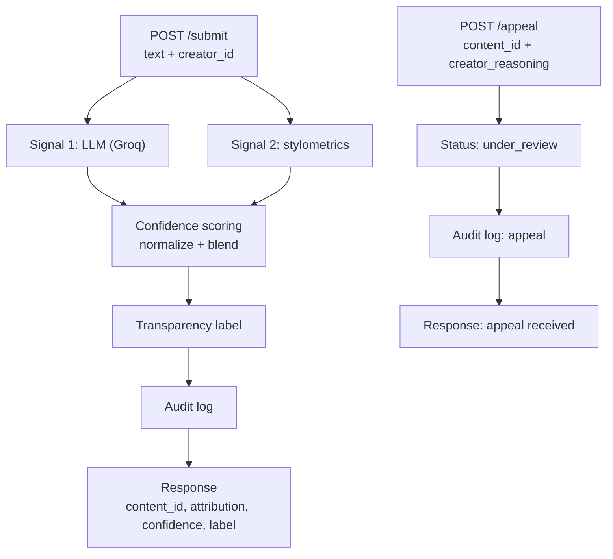

# Provenance Guard — `planning.md`


## Overview

Provenance Guard is a backend API that estimates whether a submitted piece of text
was substantially generated by AI and presented as a person's original creative
work. It returns a confidence score, a plain-language transparency label, logs
every decision, and lets creators appeal. The hard problem is not detection
accuracy — it is behaving honestly when the system is unsure.

---

## What this system detects (scope stance)

**Substantial Generation** This system detects 
**text substantially generated by AI and passed off as a person's original work**; it
does *not* try to flag any AI involvement. Light AI polishing and grammar/spell tools
do not count as AI generation, and the system stays deliberately cautious about
accusing real people.

Rationale: the goal is to protect attribution and inform readers, not to police
creativity. False positives (accusing a real human) are worse than false negatives
on a creative platform, so the system is deliberately cautious about accusing people.

Edge cases under this stance:
- Human-written, AI-polished → closer to human / uncertain, never confidently AI.
- AI-drafted, lightly human-edited → AI / uncertain depending on extent of edits.
- Grammar/spell tools (Grammarly, autocomplete) → not counted as AI generation.

**Decision (confirmed):** Option A — "substantial generation." 

---

## The five planning questions

The five answers the spec requires (each answered in full in its own section below):

1. **Detection signals** — what are your 2+ signals, what does each measure, what
   does each one's output look like, and how do you combine them into one score?
   → *Detection signals* + *Confidence scoring*.

2. **Uncertainty representation** — what does a confidence score of 0.6 mean? How do
   you map raw signal outputs to a calibrated score? What threshold separates "likely
   AI" from "uncertain" from "likely human"? → *Confidence scoring* + *Transparency labels*.

3. **Transparency label design** — exact text for a high-confidence AI result, a
   high-confidence human result, and an uncertain result. → *Transparency labels*.

4. **Appeals workflow** — who can appeal, what they provide, what the system does on
   receipt (status changes, logging), and what a human reviewer sees. → *Appeals workflow*.

5. **Anticipated edge cases** — at least two *specific* content types your system
   handles poorly, and why. → *Anticipated edge cases*.

---

## Detection signals

Two genuinely independent signals: one semantic, one structural. They fail in
different situations, so their combination is more informative than either alone.

### Signal 1 — LLM classification (Groq)

- **Captures:** semantic and stylistic coherence, holistically — whether the
  argument develops, whether the register reads "AI-polished," overall feel.
- **Output format (what I parse):**
  ```json
  {"verdict": "human|ai", "ai_likelihood": 0.0, "reasoning": "one sentence"}
  ```
  Call Groq with low `temperature` for stability; fall back gracefully if the API
  errors or returns malformed JSON.
- **Blind spot:** it's an AI judging AI — uncalibrated (will say 0.95 when unsure),
  non-deterministic, can be gamed by text written to "sound human," and tends to
  over-flag formal or non-native human writing.

### Signal 2 — stylometric heuristics (pure Python)

Three metrics, each capturing a *distinct* property (word choice, punctuation
habits, structural rhythm) so they aren't redundant — directly satisfying the
"each signal captures a distinct property" objective:

1. **Function word frequency** — the rate of common function words (the, of, and, to,
   however…) across the text, treated as a profile. *Why:* function words are the
   single strongest signal in classical authorship attribution, because writers use
   them unconsciously and consistently. For human-vs-AI specifically: AI tends to use
   them at more uniform, predictable rates than an individual human's idiosyncratic
   pattern. *Design note (how many words):* use a **fixed, curated list of ~30–50 of
   the most common English function words** (articles, prepositions, conjunctions,
   pronouns, auxiliary verbs). The count is a tunable parameter — the literature uses
   50–200 (≈100 is a common default), but it interacts with text length: rarer words
   need more text to give a stable rate, so for short inputs (poems, excerpts) the
   *lower* end is more reliable. A defensible cutoff is "words frequent enough to
   measure" (~≥2 per 1,000 words), which lands around 25–40 words before topic words
   creep in. Use the **same list every time** so rates are comparable.
   *Resolved approach (Burrows's Delta):* for each word compute its rate, then
   **standardize** it (z-score using a reference mean + spread per word), so common
   words don't dominate. Compute the Delta distance (mean absolute z-difference) to a
   **human reference** profile and an **AI reference** profile, then map to a 0–1
   sub-score via `d_human / (d_human + d_ai)` — `0` = closer to human, `1` = closer to
   AI, `0.5` = equidistant ("can't tell"). This sub-score is one of three stylometric
   metrics; it feeds the signal-2 score, which then blends with signal 1.
   **[YOUR CALL] at build time (M4):** where the reference statistics come from —
   published human rates + generated AI samples, or small human/AI text sets you
   average. Rough references are fine if documented.
   *(Grounding: this is the Burrows's-Delta / most-frequent-word approach, validated
   for AI detection at >80% accuracy even on ~100-word excerpts, with accuracy
   sensitive to text length and feature count.)*

2. **Punctuation density** — punctuation marks (commas, semicolons, dashes, colons)
   per sentence. *Why:* humans are idiosyncratic about punctuation; AI tends to be
   tidy and predictable.

3. **Sentence-length variance (burstiness)** — how much sentence length varies.
   *Why:* "burstiness" is one of the two named pillars of AI-text detection (alongside
   perplexity); humans write in bursts of long and short, machine text trends uniform.
   Chosen over type-token ratio, which saturated (~0.88 across every sample) in a live
   test on short texts and so separated nothing.

- **Captures:** structural and lexical-habit uniformity — humans write unevenly, AI
  trends smooth and regular.
- **Blind spot:** polished/formal human writers look "too clean" (false-positive
  risk); lightly-edited AI drifts toward "human"; unreliable on short text; blind to
  meaning. (See *Anticipated edge cases*.)
- **Deterministic** — the steady cross-check against signal 1's wobble.

**Prior art / grounding.** These metrics sit in two established lineages, not
invented for this project: classical *stylometry* / authorship attribution (Mosteller
& Wallace's 1963 Federalist Papers study; standard feature families — vocabulary
richness, sentence structure, function words, punctuation) and modern *AI-text
detection* (perplexity, burstiness, log-probability curvature / DetectGPT,
classifier-based methods; tools such as GPTZero, Originality.ai, Turnitin, Pangram).
Field consensus is that these heuristics are brittle and weakening as models learn to
write with human-like perplexity and burstiness — which is exactly why this system
pairs them with a second signal and leans on honest uncertainty and appeals rather
than claiming to be a reliable oracle.

---

## Confidence scoring

One score, `ai_likelihood`, from `0.0` (clearly human) to `1.0` (clearly AI).

What specific scores mean to a reader:
- **`0.5`** = genuinely can't tell — lands in the uncertain band.
- **`0.6`** = leans AI but *not* confidently — still inside the uncertain band, not an
  accusation. Only past the `0.70` threshold does the system say "likely AI."
- The number is never shown raw to users; it only selects a label.

Mapping raw outputs → one calibrated score (the folding recipe):
1. Compute each signal's raw output (signal 1 returns `ai_likelihood` 0–1; signal 2
   returns raw metrics on different scales).
2. Normalize each to a 0–1 "how AI-like" scale so they're comparable.
3. Blend with weights → single `ai_likelihood`.

**Thresholds (confirmed): `0.40` / `0.70`** — intentionally **asymmetric**. The
"likely AI" bar (0.70) sits further from the middle than the "likely human" bar
(0.40), giving human writers more wiggle room before any accusation, because a false
positive is the costliest error. Bands are contiguous (no gaps, no overlaps): every
score lands in exactly one.

**[YOUR CALL] at build time (M4):** the normalization mappings, the signal weights,
and what to do when the two signals strongly disagree (recommended: pull toward the
uncertain band rather than averaging to a confident-looking middle). Calibrate on a
real spread of known-human and known-AI texts — do *not* fit the constants to a
handful of examples (overfitting) — and state how you tested that scores are
meaningful.

---

## Transparency labels

Thresholds are intentionally **asymmetric** — the bar to say "likely AI" is higher
than the bar to say "likely human," because wrongly accusing a human is the costlier
error. The uncertain band is wide on purpose.

| `ai_likelihood` | `attribution`  | Variant               |
| --------------- | -------------- | --------------------- |
| `0.00 – 0.40`   | `likely_human` | High-confidence human |
| `0.40 – 0.70`   | `uncertain`    | Uncertain             |
| `0.70 – 1.00`   | `likely_ai`    | High-confidence AI    |

**Thresholds confirmed: `0.40` / `0.70`** (asymmetric — the AI bar is further out to
protect human writers). May be calibrated at build time, but the structure is fixed.

Exact display text:

- **High-confidence human:** "Likely human-written. Our automated check found little
  sign of AI generation in this piece. Automated checks aren't perfect — this is a
  signal, not a verdict."
- **Uncertain:** "Uncertain. Our check couldn't confidently tell whether a person
  wrote this or AI generated it. This is common for short pieces, or for writing a
  person wrote and then used AI to edit. No conclusion is being drawn."
- **High-confidence AI:** "Likely AI-generated. Our automated check found strong
  signs this text was produced or heavily shaped by AI. This is an automated
  assessment, not a certainty — if you wrote this yourself, you can appeal."

Wording principles: no hard authorship claim ("likely"/"signs of", never "this was
written by AI"); every label admits fallibility; the AI label names the appeal path;
the uncertain label explains *why*. **[YOUR CALL]** Rewrite in your voice and
user-test on someone who hasn't seen the project.

---

## Appeals workflow

**Who can appeal:** the creator of a flagged submission (matched by `creator_id`),
typically when their work was labeled likely-AI or uncertain and they believe it's
wrong.

**What they provide:** the `content_id` of the submission and `creator_reasoning`
(their explanation in plain text).

`POST /appeal` then:
1. Updates the content's status to `under_review`.
2. Logs the appeal alongside the original decision in the audit log.
3. Returns a confirmation that the appeal was received.

**What a human reviewer sees** when they open the appeal queue: the original
submission, its `attribution` and `confidence`, both individual signal scores, and
the creator's reasoning — everything needed to make a human judgment. (Pulled from
the audit log; a reviewer UI is out of scope, but the log holds all of it.)

No automated re-classification required.

---

## Anticipated edge cases

Specific content types this system handles poorly, each tied to a property of a
signal (not generic "it's sometimes wrong"):

1. **Formal or academic human writing** (false positive — the costly direction).
   A careful essayist or researcher writes with controlled sentence lengths, precise
   vocabulary, and consistent punctuation. Signal 2's core assumption — "uniform
   structure = AI" — misfires here and flags the very humans the platform most wants
   to protect. Signal 1 can also over-flag formal register.

2. **AI text lightly edited by a human** (false negative). Varying a few sentence
   lengths and swapping some words drifts the stylometrics toward "human" without
   changing that the content was substantially AI-generated — because signal 2 only
   measures surface structure, which is exactly what light editing alters. Signal 1
   can be talked past the same way.

3. **(Boundary case) AI-optimized human writing.** Person writes it, AI polishes it.
   Signal 2 leans AI (smoothed structure), signal 1 leans human (genuine ideas);
   they disagree, so it correctly lands *uncertain*. Included because it shows the
   uncertain band working as intended rather than a clean failure.


---

## Rate limiting

Applied to `POST /submit` via Flask-Limiter.

**Unit:** one *request* = one submission (one POST carrying one `text` + `creator_id`).
The limit counts **requests/API calls, not text length** — a 50-word poem and a
5,000-word essay each count as exactly one. It is enforced **per client identifier**
(each client gets its own counter), not as one shared global limit.

**Chosen limits: 10 requests/minute + 100 requests/day, per client.**

Reasoning (defensible, not arbitrary):
- *Expensive write.* `/submit` is a POST that calls an LLM (Groq), so it belongs in
  the strict tier — industry norm is ~10–30/min for expensive writes vs 60–300/min
  for cheap reads.
- *10/min = burst protection.* A creator submitting their own original writing posts
  a handful of pieces, never dozens a minute, so 10/min is generous for any real
  human while a flooding script hits the wall within seconds.
- *100/day = sustained-abuse cap + cost control.* 100 original submissions in a day
  is already a huge amount of genuine writing; this stops a slow-drip adversary
  staying under the per-minute radar, and bounds Groq API spend (every call costs
  quota).
- *Identifier:* keyed by IP (`get_remote_address`) for now; **`creator_id` in
  production** would be more robust, since IPs can be shared or rotated. (Good
  "what I'd improve" line for the README.)
- Returns `429 Too Many Requests` past the limit — capture that 429 output in the
  README as the evidence graders want.


---

## Audit log

Structured (JSON or SQLite), not `print()`. **Every attribution decision** writes an
entry, and appeals are captured too.

```json
{
  "content_id": "uuid",
  "creator_id": "string",
  "timestamp": "ISO-8601",
  "attribution": "likely_human|uncertain|likely_ai",
  "confidence": 0.0,
  "llm_score": 0.0,
  "stylometric_score": 0.0,
  "status": "classified|under_review",
  "appeal_reasoning": null
}
```

**Maps to the spec requirement** ("confidence score, signals used, and any appeals,
in a structured log, ≥3 entries visible"): `confidence` = confidence score;
`llm_score` + `stylometric_score` = signals used (named, so the log self-documents
*which* signals); `status` + `appeal_reasoning` = any appeals; plus `timestamp`,
`content_id`, `creator_id`. Surface ≥3 entries via `GET /log` for the README.

**Decision (confirmed):** the fields above satisfy the requirement.

**Optional upgrades (beyond spec — README "what I'd improve" material), not required:**
- Store the submitted **text or a snippet** so a reviewer can see the actual writing,
  not just the scores.
- Make the log **append-only**: write an appeal as a *new* entry sharing the
  `content_id` instead of editing the original, preserving full history.

---

## API contract

- `POST /submit` — body `{ "text", "creator_id" }` → returns
  `{ "content_id", "attribution", "confidence", "label" }`.
- `POST /appeal` — body `{ "content_id", "creator_reasoning" }` → returns
  confirmation; sets status to `under_review`.
- `GET /log` — returns recent audit-log entries as JSON (for documentation/grading).

---

## Architecture

Narrative: a creator submits text to `/submit`. The raw text goes to both signals;
each returns a score. Confidence scoring normalizes and blends them into one
`ai_likelihood`. That score selects a transparency label. The decision (scores,
label, IDs) is written to the audit log, and the response returns to the platform.
Separately, `/appeal` takes a `content_id`, flips status to `under_review`, logs the
appeal next to the original decision, and confirms receipt.



---
## Tech Stack
| Component | Tool | Notes |
|---|---|---|
| API framework | Flask | Free, lightweight |
| Detection signal 1 | Groq (`llama-3.3-70b-versatile`) | Free tier — same account as Projects 1–3 |
| Detection signal 2 | Stylometric heuristics | Pure Python, no external libraries needed |
| Rate limiting | `Flask-Limiter` | Free |
| Audit log | SQLite (built-in) or structured JSON | No additional setup |
---
---

## AI tool plan (Milestones 3–5)

For each milestone, which spec sections I'll feed to an AI tool, what I'll ask it to
generate, and how I'll verify the output before using it.

- **Milestone 3 (submit + signal 1):** feed *Detection signals* + *API contract* +
  diagram → ask for the Flask skeleton with a `POST /submit` stub and the signal-1
  function. **Verify:** function signature matches the output format above; route
  matches the contract; test signal 1 standalone before wiring it in.
- **Milestone 4 (signal 2 + scoring):** feed *Detection signals* + *Confidence
  scoring* + diagram → ask for the signal-2 function and the blending logic.
  **Verify:** scoring matches my thresholds; test on 4 deliberate inputs.
- **Milestone 5 (production layer):** feed *Transparency labels* + *Appeals* +
  *Rate limiting* + *Audit log* → ask for the label function, `/appeal`, limiter
  config, and full log entry. **Verify:** label text matches mine exactly; appeal
  updates status and logs; `429`s appear past the limit.


---

## AI usage log (feeds the README's required AI-usage section)

**Instance 1 — researching and choosing the stylometric signal (signal 2).**

- *What I directed:* I asked the AI to explain the candidate stylometric metrics
  (sentence-length variance, type-token ratio, punctuation density, sentence
  complexity), then to clarify where these properties come from and what
  industry standards or references back them.
- *What it produced:* (1) a live demo that computed the metrics on the spec's four
  sample texts and revealed the scoring flatlined — type-token ratio saturated
  (~0.88) on the short inputs, separating nothing; (2) web research grounding the
  metrics in two real fields — classical stylometry (Mosteller & Wallace 1963;
  function words as the strongest authorship signal) and modern AI detection
  (burstiness = sentence-length variance, perplexity, DetectGPT, GPTZero) — including
  the field's own consensus that these heuristics are brittle.
- *What I decided / revised / overrode:* I selected **function word frequency,
  punctuation density, and sentence-length variance (burstiness)**, each for a
  distinct documented reason. I **overrode the spec's default pairing** (length
  variance + type-token ratio): the live test showed TTR separated nothing on short
  text, so I dropped it for burstiness, a named pillar of AI detection. I also
  **sharpened the function-word rationale** — it's strongest for author-vs-author, so
  I reframed it for human-vs-AI as "AI uses function words at more uniform rates than
  an individual human's idiosyncratic pattern" rather than accepting "it's just the
  strongest signal."
